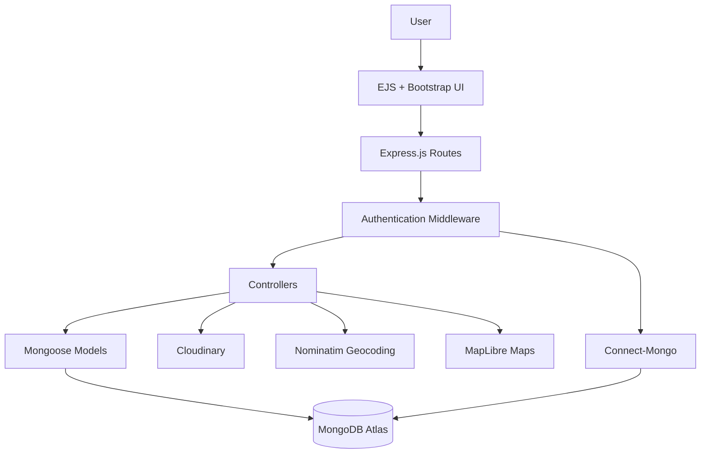
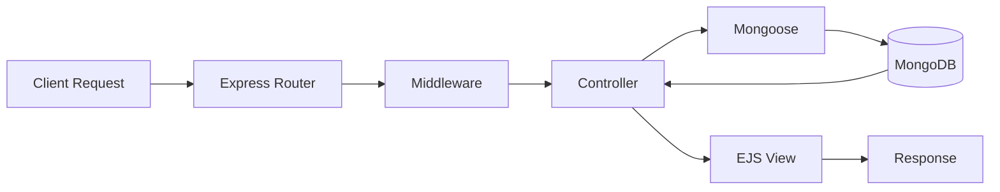

<div align="center">

# ✈️ TripZeal

**A full-stack travel accommodation platform for discovering, creating, and managing destination listings.**

[](https://tripzeal.onrender.com/listings)
<!-- [](https://nodejs.org)
[](https://mongodb.com)
[](https://expressjs.com) -->

</div>

---

## Overview

TripZeal is a full-stack travel accommodation platform built with **Node.js, Express.js, MongoDB, and EJS**. Users can explore destination listings, search and filter accommodations, create and manage their own listings, upload images, and interact through reviews.

The application follows **MVC architecture** and implements authentication, authorization, server-side validation, persistent sessions, cloud-based image storage, and location-based mapping.

---

## Features

**Authentication & Authorization**
- User registration and login via Passport.js
- Protected routes — only listing/review owners can edit or delete

**Listing Management**
- Full CRUD — create, view, edit, delete listings
- Category-based organization (Beaches, Mountains, Castles, Villas and more)

**Search & Filtering**
- Search by title, location, or country
- Filter listings by category

**Reviews**
- Add and delete reviews with star ratings
- Ownership-based authorization

**Image Management**
- Upload via Multer, stored on Cloudinary
- Image replacement on listing update

**Location & Maps**
- Geocode listing locations to coordinates
- Display on interactive OpenStreet map on every listing

**Validation & Error Handling**
- Joi server-side validation + Bootstrap client-side
- Custom error handling with flash messages

**Sessions**
- Express sessions backed by MongoDB via Connect-Mongo

---

## 🛠️ Tech Stack

| Category | Technologies |
|---|---|
| Frontend | EJS, Bootstrap 5, JavaScript |
| Backend | Node.js, Express.js |
| Database | MongoDB, Mongoose |
| Authentication | Passport.js, Express Session |
| Validation | Joi |
| Image Storage | Cloudinary, Multer |
| Maps | OpenStreet GL JS |
| Architecture | MVC |
| Deployment | Render + MongoDB Atlas |

---

## Application Architecture

---

##  Request Flow



<!-- --- -->

<!-- ## 📸 Screenshots

### 🏠 Homepage -->
<!--  -->

<!-- ### 🔎 Explore & Search -->
<!--  -->

<!-- ### 🏡 Listing Details -->
<!--  -->

<!-- ### 🗺️ Location & Map -->
<!--  -->

<!-- ### ➕ Create Listing -->
<!--  -->

---

##  Getting Started

### Prerequisites
- Node.js v18+
- MongoDB (local or Atlas)
- Cloudinary account

### Installation

```bash
# 1. Clone the repo
git clone https://github.com/manaswi3/TripZeal.git
cd TripZeal

# 2. Install dependencies
npm install

# 3. Create .env file
touch .env
```

Add to your `.env`:

```env
ATLASDB_URL=your_mongodb_connection_string
SECRET=your_session_secret
CLOUD_NAME=your_cloudinary_cloud_name
CLOUD_API_KEY=your_cloudinary_api_key
CLOUD_API_SECRET=your_cloudinary_api_secret
```

```bash
# 4. (Optional) Seed the database
node init/index.js

# 5. Start the server
node app.js
```

Visit `http://localhost:8080/listings`

---

## 📁 Project Structure

```
TripZeal/
│
├── controllers/       # Business logic (listings, reviews, users)
├── models/            # Mongoose schemas
├── routes/            # Express routers
├── views/             # EJS templates
│   ├── layouts/       # Boilerplate layout
│   ├── listings/      # index, show, new, edit
│   └── users/         # login, signup
├── public/            # Static assets (CSS, JS, images)
├── utils/             # ExpressError, wrapAsync helpers
├── middleware.js      # isLoggedIn, isOwner, isReviewAuthor
├── cloudConfig.js     # Cloudinary configuration
├── schema_valid.js    # Joi validation schemas
├── app.js             # Entry point
└── package.json
```

---

##  Security

- Environment variables for all secrets and credentials
- Authentication and authorization on all protected routes
- Server-side Joi validation on all form submissions
- Ownership checks before any listing or review modification
- Sessions stored securely in MongoDB

---

##  Deployment

| | |
|---|---|
| **Live App** | [tripzeal.onrender.com](https://tripzeal.onrender.com/listings) |
| **Database** | MongoDB Atlas |
| **Images** | Cloudinary |
| **Hosting** | Render |

---

##  What I Learned

Through TripZeal, I gained practical experience building and deploying a full-stack MVC application — designing RESTful routes, implementing authentication and authorization, integrating third-party services (Cloudinary, OpenStreet Nominatim API), handling cloud image storage, working with geospatial data, and managing production environment variables and deployment.

---

##  Future Improvements

- Booking and reservation functionality
- Advanced sorting and price range filters
- Map-based listing discovery
- User profiles and saved/wishlisted listings
- Automated testing (Jest / Mocha)

---

## 👩‍💻 Author

**Manaswi Saxena**

[](https://github.com/manaswi3)